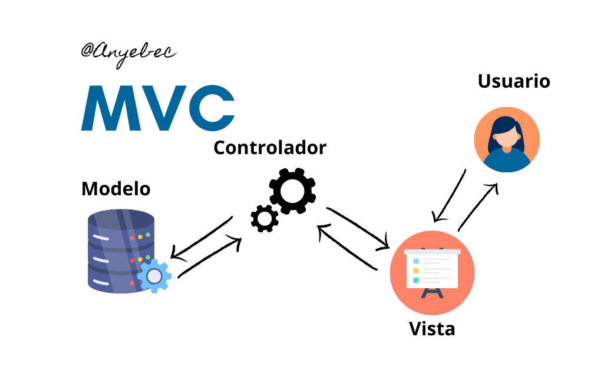
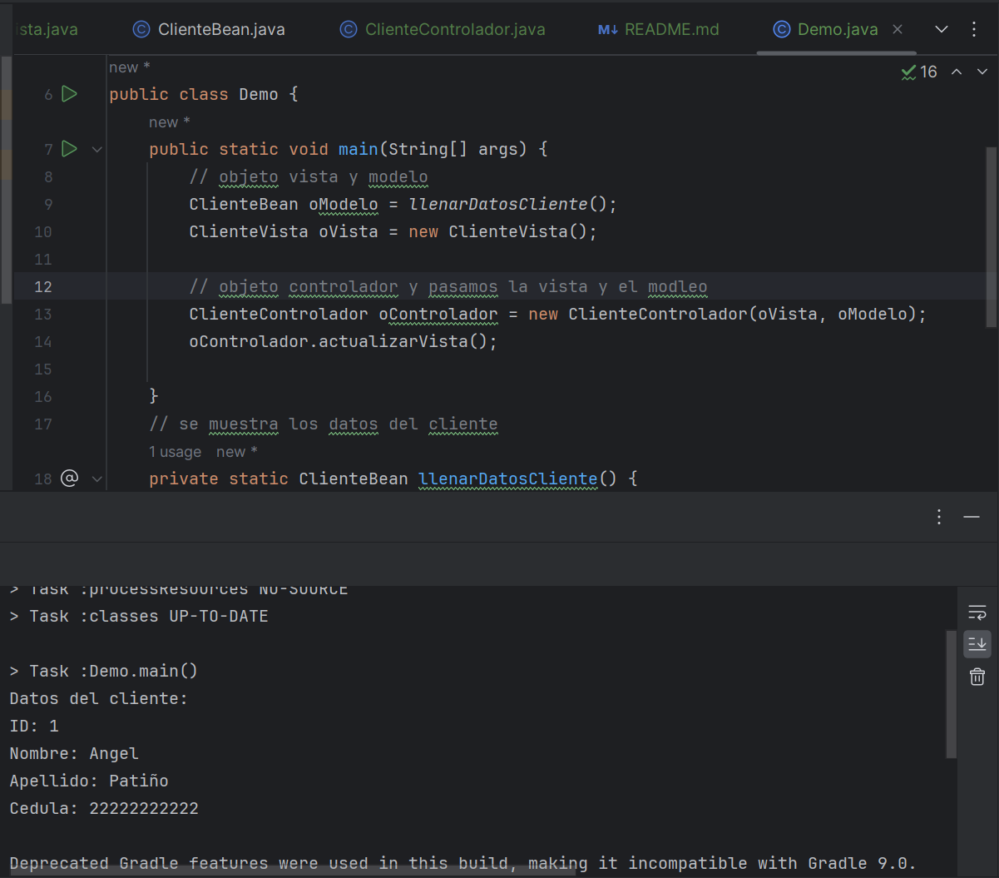

# Customer Management System

This project implements a simple Customer Management System in Java, using the Model-View-Controller (MVC) design pattern. The application consists of three main components: the model (`ClienteBean`), the view (`ClienteVista`), and the controller (`ClienteControlador`).

# Result
### "Structure"
 
### Result finally


## Repository Contents

- `src/org/espe/modelo/ClienteBean.java`: Class defining the customer data model.
- `src/org/espe/vista/ClienteVista.java`: Class handling the presentation of customer data.
- `src/org/espe/controlador/ClienteControlador.java`: Class acting as an intermediary between the model and the view.
- `src/org/espe/prueba/Demo.java`: Test class that instantiates the model, view, and controller to demonstrate the system's functionality.

## Execution Instructions

1. Clone this repository to your local development environment.

```bash
git clone https://github.com/Anyel-ec/Java-Introduce-MVC 
```

### Contributions
Contributions are welcome. If you encounter any issues or have suggestions for improvement, feel free to open an issue or submit a pull request.
